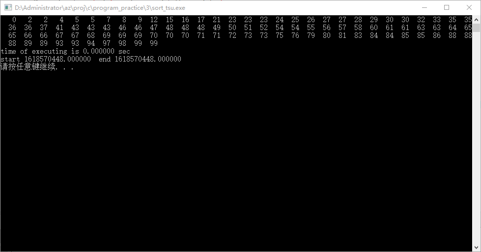
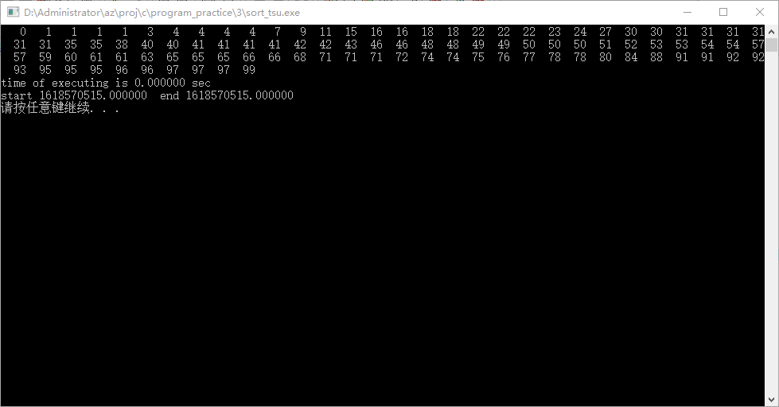
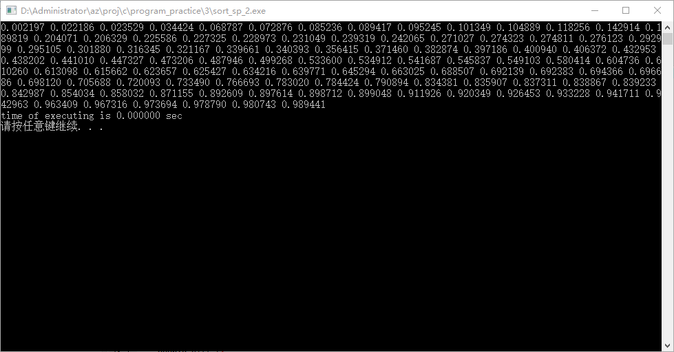
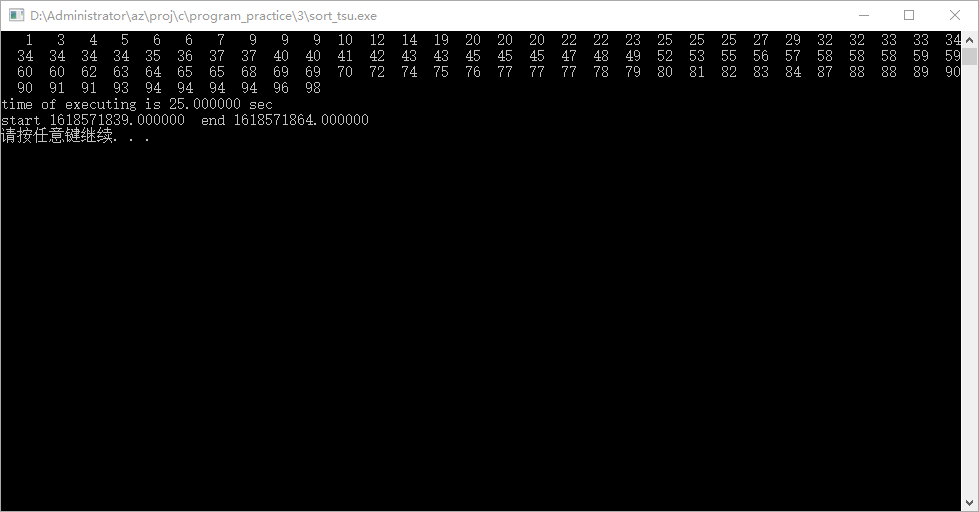
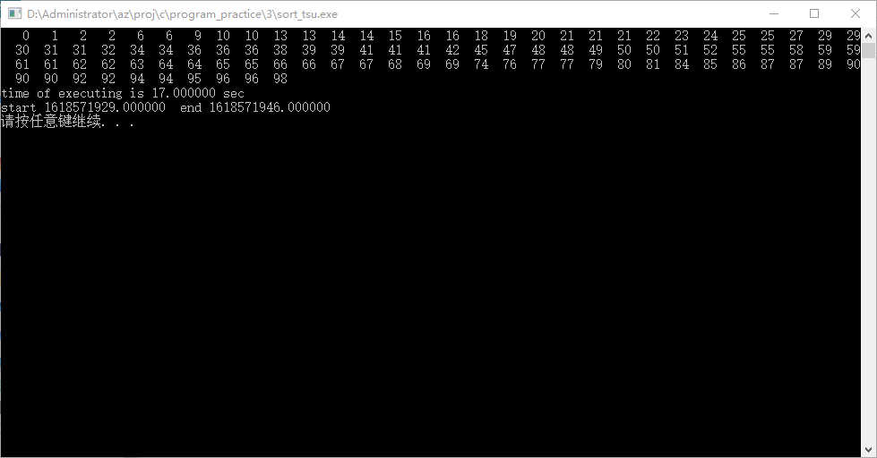
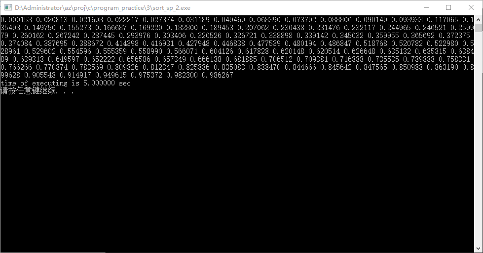
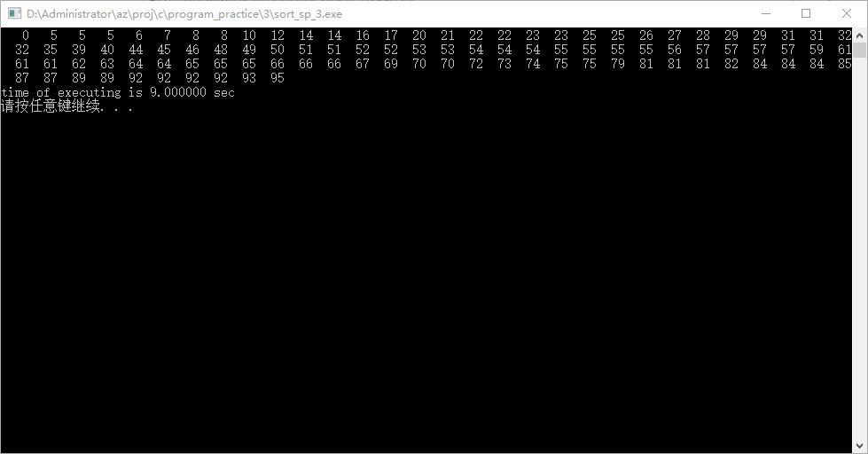
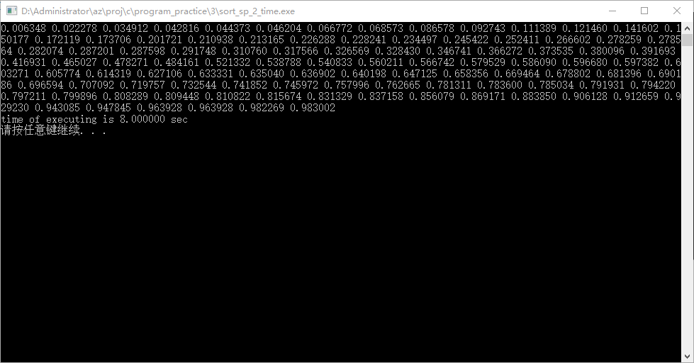

# 排序相关章节练习

[TOC]

## 具体代码实现

### 通常算法

#### 代码总览 sort_tsu.c

```c
# include<stdio.h>
# include<stdlib.h>
# include<time.h>
# include<windows.h>
# define SIZE_A 100
# define MAX_NUM 99
// 在此更改随机生成的数组的长度和随机数最大值,同时记得更改zen_print()中的打印模式

typedef int DataType;
void swap(DataType *a, DataType *b);
void random(DataType a[], int n, int range_max_num);
void zen_print(DataType a[], int n);        // n表示存放元素的个数
int sequential_search(DataType a[], int n, DataType key);   // 顺序查找
int binary_search(DataType a[], int n, DataType key);       // 二分查找 递增的数组可用

void bubble_sort(DataType a[], int n);      // 冒泡排序
void select_sort(DataType a[], int n);      // 简单选择排序
void insert_sort(DataType a[], int n);      // 直接插入排序

void merge_sort(DataType a[], DataType aux[], int bottom, int top);     // 归并排序
void merge(DataType a[], DataType aux[], int bottom, int mid, int top); // 归并排序中的归并部分

void quick_sort(DataType a[], int bottom, int top);         // 快速排序
int quick_pass(DataType a[], int bottom, int top);          // 快速排序中的划分部分
void quick_sort_bi(DataType a[], int bottom, int top);      // 快速排序 前两个整合成一个
void quick_sort_tsu(DataType a[], int bottom, int top);     // 快速排序非递归方法

// 以下三个函数来自program_practice_2_1中使用二分法排序的通常方法(1个函数)与递归算法(2个函数)
void order_tsu(int *a, int n);
void order_inter_re(int *a, int n);
int order_re(int *a, int num, int bottom, int top);

int main(int argc, char const *argv[]) {
    DataType a[SIZE_A], aux[SIZE_A];
    int i;
    time_t start_t, end_t;
    double diff_t;

    srand(time(0));
    random(a, SIZE_A, MAX_NUM);

    time(&start_t);
    // 任选一种即可
    bubble_sort(a, SIZE_A);
    // select_sort(a, SIZE_A);
    // insert_sort(a, SIZE_A);
    // merge_sort(a, aux, 0, SIZE_A - 1);
    // quick_sort(a, 0, SIZE_A - 1);
    // quick_sort_bi(a, 0, SIZE_A - 1);
	
    time(&end_t);
    diff_t = difftime(end_t, start_t);  // 求函数运行前后的时间差

    zen_print(a, SIZE_A);
    printf("time of executing is %f sec \n", diff_t);
    printf("start %f	 end %f\n",(double)start_t,(double)end_t); 

    system("pause");
    return 0;
}

void swap(DataType *a, DataType *b){
    DataType temp;
    temp = *a;
    *a = *b;
    *b = temp;
}

void random(DataType a[], int n, int range_max_num){
    int i;
    for(i = 0; i < n; i++) a[i] = rand() % (range_max_num + 1);    // 随机数存入数组
}

void zen_print(DataType a[], int n){
    int i;
    for(i = 0; i < n; i++){
        printf("%4d", a[i]);
    }
    printf("\n");
}

int sequential_search(DataType a[], int n, DataType key){
    int i;
    for (i = 0; i <n; i++) {
        if(a[i] == key) return i;
    }
    return -1;
}

int binary_search(DataType a[], int n, DataType key){
    int bottom = 0, top = n - 1;
        int mid;

        while(bottom <= top){
            mid = (top + bottom) / 2;
            if(a[mid] == key) return mid;
            if(a[mid] > key) top = mid - 1;
            if(a[mid] < key) bottom = mid + 1;
        }
        return -1;
}

void bubble_sort(DataType a[], int n){
    int i, j;
    for(i = 0; i < n - 1; i++) for(j = 0; j < n - i - 1; j++){
        if(a[j] > a[j + 1]) swap(a + j, a + j + 1);
    }
}

void select_sort(DataType a[], int n){
    int i, j, min;
    for(i = 0; i < n - 1; i++){
        min = i;
        for(j = i + 1; j < n; j++){
            if(a[min] > a[j]) min = j;  // 排查i标后最小的元素
        }
        swap(a + min, a + i);
    }
}

void insert_sort(DataType a[], int n){
    int i, j, d2i;  // d2i data to insetr
    for (i = 0; i < n; i++) {
        d2i = a[i];
        j = i - 1;
        while (j >= 0 && d2i < a[j]) {
            a[j + 1] = a[j];
            j --;
        }
        a[j + 1] = d2i;
    }
}

void merge_sort(DataType a[], DataType aux[], int bottom, int top){
    if(bottom >= top) return;   // 只有1个别排了，也别分了

    int i;
    int mid = (top + bottom) / 2;

    merge_sort(a, aux, bottom, mid);    // 前半排序
    merge_sort(a, aux, mid + 1, top);   // 后半排序

    merge(a, aux, bottom, mid ,top);    // 归并

    for(i = bottom; i <= top; i++) a[i] = aux[i];
}

void merge(DataType a[], DataType aux[], int bottom, int mid, int top){
    int i = bottom;     // 前部分的起点
    int k = bottom;     // 单纯地控制aux[]
    int j = mid + 1;    // 后部分的起点

    while (i <= mid && j <= top) {
        if(a[i] <= a[j]) aux[k++] = a[i++];
        else aux[k++] = a[j++];
    }   // 拷贝较小的元素

    while(i <= mid) aux[k++] = a[i++];
    while(j <= top) aux[k++] = a[j++];  // 处理剩余的元素
}

void quick_sort(DataType a[], int bottom, int top){
    if(bottom >= top) return;   // 只有1个别排了，也别分了

    int pivot = quick_pass(a, bottom, top);     // 划分并返回枢轴位置

    quick_sort(a, bottom, pivot - 1);
    quick_sort(a, pivot + 1, top);
}

int quick_pass(DataType a[], int bottom, int top){
    DataType x = a[bottom];     // 先选第一个
    while(bottom < top){
        while(bottom < top && x <= a[top]) top--;       // 从右向左扫描
        if(bottom == top) break;
        a[bottom++] = a[top];

        while(bottom < top && x >= a[bottom]) bottom++; // 从左向右扫描
        if(bottom == top) break;
        a[top--] = a[bottom];
    }
    a[bottom] = x;
    return bottom;
}

void quick_sort_bi(DataType a[], int bottom, int top){
    if(bottom >= top) return;

    DataType ib = bottom, it = top;
    DataType x = a[ib];
    while(ib < it){
        while(ib < it && x <= a[it]) it--;      // 从右向左扫描
        if(ib == it) break;
        a[ib++] = a[it];

        while(ib < it && x >= a[ib]) ib++;      // 从左向右扫描
        if(ib == it) break;
        a[it--] = a[ib];
    }
    a[ib] = x;
    int pivot = ib;

    quick_sort(a, bottom, pivot - 1);
    quick_sort(a, pivot + 1, top);
}

// 反正默认的DataType是int, 所以先不改了
void order_tsu(int *a, int n){
    int bottom = 0, top, mid, i, j; // i j 是用来控制循环的
    int temp;   // to store per number

    for(i = 0; i < n; i++){
        // 每一次在for中调用while以保持在这个元素之前都是已经排好序了的
        temp = *(a + i);
        bottom = 0;
        top = i - 1;

        while(bottom <= top){
            mid = (top + bottom) / 2;
            if(*(a + mid) > *(a + i)) top = mid - 1;
            else bottom = mid + 1;      // 不管两者是否相等总之插在后方就行了
        }

        for(j = i - 1; j >= bottom; j--) *(a + j + 1) = *(a + j); 	// 后移中...
        *(a + bottom) = temp;
    }
}

int order_re(int *a, int num, int bottom, int top){
    if(bottom <= top){
        int mid = (top + bottom) / 2;
        if(*(a + mid) > num) return order_re(a, num, bottom, mid - 1);
        else return order_re(a, num, mid + 1, top);
    }
    else return bottom;
}

void order_inter_re(int *a, int n){
    int bottom = 0, top, mid, i, j; // i j 是用来控制循环的
    int temp;   // to store per number

    for(i = 0; i < n; i++){
        temp = *(a + i);
        bottom = 0;
        top = i - 1;

        mid = order_re(a, temp, bottom, top);

        for(j = i - 1; j >= mid; j++) *(a + j + 1) = *(a + j); 	// 后移中...
        *(a + mid) = temp;
    }
}
```

#### 实现数组中元素互换的函数

```c
void swap(DataType *a, DataType *b){
    DataType temp;
    temp = *a;
    *a = *b;
    *b = temp;
}
```

#### 实现生成整数的函数

```c
void random(DataType a[], int n, int range_max_num){
    int i;
    for(i = 0; i < n; i++) a[i] = rand() % (range_max_num + 1);    // 随机数存入数组
}
```

#### 实现冒泡排序的函数

```c
void bubble_sort(DataType a[], int n){
    int i, j;
    for(i = 0; i < n - 1; i++) for(j = 0; j < n - i - 1; j++){
        if(a[j] > a[j + 1]) swap(a + j, a + j + 1);
    }
}
```

#### 实现简单选择排序的函数

```c
void select_sort(DataType a[], int n){
    int i, j, min;
    for(i = 0; i < n - 1; i++){
        min = i;
        for(j = i + 1; j < n; j++){
            if(a[min] > a[j]) min = j;  // 排查i标后最小的元素
        }
        swap(a + min, a + i);
    }
}
```

#### 实现直接插入排序的函数

```c
void insert_sort(DataType a[], int n){
    int i, j, d2i;  // d2i data to insetr
    for (i = 0; i < n; i++) {
        d2i = a[i];
        j = i - 1;
        while (j >= 0 && d2i < a[j]) {
            a[j + 1] = a[j];
            j --;
        }
        a[j + 1] = d2i;
    }
}
```

#### 实现归并排序的函数

```c
void merge_sort(DataType a[], DataType aux[], int bottom, int top){
    if(bottom >= top) return;   // 只有1个别排了，也别分了

    int i;
    int mid = (top + bottom) / 2;

    merge_sort(a, aux, bottom, mid);    // 前半排序
    merge_sort(a, aux, mid + 1, top);   // 后半排序

    merge(a, aux, bottom, mid ,top);    // 归并

    for(i = bottom; i <= top; i++) a[i] = aux[i];
}

void merge(DataType a[], DataType aux[], int bottom, int mid, int top){
    int i = bottom;     // 前部分的起点
    int k = bottom;     // 单纯地控制aux[]
    int j = mid + 1;    // 后部分的起点

    while (i <= mid && j <= top) {
        if(a[i] <= a[j]) aux[k++] = a[i++];
        else aux[k++] = a[j++];
    }   // 拷贝较小的元素

    while(i <= mid) aux[k++] = a[i++];
    while(j <= top) aux[k++] = a[j++];  // 处理剩余的元素
}
```

#### 实现快速排序的函数（分歩）

```c
void quick_sort(DataType a[], int bottom, int top){
    if(bottom >= top) return;   // 只有1个别排了，也别分了

    int pivot = quick_pass(a, bottom, top);     // 划分并返回枢轴位置

    quick_sort(a, bottom, pivot - 1);
    quick_sort(a, pivot + 1, top);
}

int quick_pass(DataType a[], int bottom, int top){
    DataType x = a[bottom];     // 先选第一个
    while(bottom < top){
        while(bottom < top && x <= a[top]) top--;       // 从右向左扫描
        if(bottom == top) break;
        a[bottom++] = a[top];

        while(bottom < top && x >= a[bottom]) bottom++; // 从左向右扫描
        if(bottom == top) break;
        a[top--] = a[bottom];
    }
    a[bottom] = x;
    return bottom;
}
```

#### 实现快速排序的函数（整合）

```c
void quick_sort_bi(DataType a[], int bottom, int top){
    if(bottom >= top) return;

    DataType ib = bottom, it = top;
    DataType x = a[ib];
    while(ib < it){
        while(ib < it && x <= a[it]) it--;      // 从右向左扫描
        if(ib == it) break;
        a[ib++] = a[it];

        while(ib < it && x >= a[ib]) ib++;      // 从左向右扫描
        if(ib == it) break;
        a[it--] = a[ib];
    }
    a[ib] = x;
    int pivot = ib;

    quick_sort(a, bottom, pivot - 1);
    quick_sort(a, pivot + 1, top);
}
```

### 特殊算法

#### 代码总览 sort_sp_1_amp_2_extra.c

```c
# include<stdio.h>
# include<stdlib.h>
# include<time.h>
# include<windows.h>
# include<assert.h>
# define SIZE_A 100
# define MAX_NUM 99
// 在此更改随机生成的数组的长度和随机数最大值,同时记得更改zen_print()中的打印模式
# define BK_NUM 10
// 桶的数量,请随着随机数最大值更改,同时更改bucket_sort()中的存入桶部分

typedef int DataType;
struct bucket{
    DataType a[SIZE_A];
    int num;
};
void swap(DataType *a, DataType *b);
void random(DataType a[], int n, int range_max_num);
void zen_print(DataType a[], int n);        // n表示存放元素的个数

void bubble_sort(DataType a[], int n);      // 冒泡排序

void counter_sort(DataType a[], DataType sorted_a[], int n, int maxkey);        // 计数排序
void counter_sort_clear(DataType a[], DataType sorted_a[], int n, int maxkey);  // 更简明的计数排序

void bucket_sort_extra(DataType a[], DataType sorted_a[], int n, int num_bucket);     // 桶排序
// 对于桶排序, 进行了一些修改,使得它可以完成与计数排序差不多的功能

int main(int argc, char const *argv[]) {
    DataType a[SIZE_A], sorted_a[SIZE_A];
    int i;
    time_t start_t, end_t;
    double diff_t;

    srand(time(0));
    random(a, SIZE_A, MAX_NUM);

    time(&start_t);
    // 计数排序和桶排序
    counter_sort(a, sorted_a, SIZE_A, MAX_NUM);
    // bucket_sort_extra(a, sorted_a, SIZE_A, BK_NUM);
    time(&end_t);
    diff_t = difftime(end_t, start_t);  // 求函数运行前后的时间差

    zen_print(sorted_a, SIZE_A);
    printf("time of executing is %f sec \n", diff_t);

    system("pause");
    return 0;
}

void swap(DataType *a, DataType *b){
    DataType temp;
    temp = *a;
    *a = *b;
    *b = temp;
}

void random(DataType a[], int n, int range_max_num){
    int i;
    for(i = 0; i < n; i++) a[i] = rand() % (range_max_num + 1);    // 随机数存入数组
}

void zen_print(DataType a[], int n){
    int i;
    for(i = 0; i < n; i++){
        printf("%4d", a[i]);
    }
    printf("\n");
}

void bubble_sort(DataType a[], int n){
    int i, j;
    for(i = 0; i < n - 1; i++) for(j = 0; j < n - i - 1; j++){
        if(a[j] > a[j + 1]) swap(a + j, a + j + 1);
    }
}

void counter_sort(DataType a[], DataType sorted_a[], int n, int maxkey){
    int key, i;
    int count[maxkey + 1];
    for (key = 0; key <= maxkey; key++) count[key] = 0;
    for (i = 0; i < n; i++) count[a[i]]++;

    int start = 0, next;
    for (key = 0; key <= maxkey; key++){
        next = start + count[key];
        count[key] = start;
        start = next;
    }
    assert(start == n);

    for (i = 0; i < n; i++) sorted_a[count[a[i]]++] = a[i]; // 相同的元素会放在下一位
}

void counter_sort_clear(DataType a[], DataType sorted_a[], int n, int maxkey){
    int key, i;
    int count[maxkey + 1];
    for (key = 0; key <= maxkey; key++) count[key] = 0;
    for (i = 0; i < n; i++) count[a[i]]++;

    int pos = 0;
    for (key = 0; key <= maxkey; key++){
        for(i = 1; i <= count[key]; i++){
            sorted_a[pos++] = key;
        }
    }
}

void bucket_sort_extra(DataType a[], DataType sorted_a[], int n, int num_bucket){
    struct bucket bk[num_bucket];
    int i, j;
    int i4s = 0;    // i4s i for sorted_a

    for (i = 0; i < num_bucket; i++) {  // 初始化
        bk[i].num = 0;
    }

    for (i = 0; i < n; i++) {           // 存入桶
        int k = a[i] / 10;
        bk[k].a[bk[k].num] = a[i];
        bk[k].num ++;
    }

    for (i = 0; i < num_bucket; i++) {  // 处理每个桶
        if(bk[i].num == 0) continue;
        else if(bk[i].num == 1) sorted_a[i4s++] = bk[i].a[0];
        else{
            bubble_sort(bk[i].a, bk[i].num);    // 对于每个桶(数据2个及以上)使用了冒泡排序
            for(j = 0; j < bk[i].num; j++) sorted_a[i4s++] = bk[i].a[j];
        }
    }
}
```

#### 代码总览 sort_sp_2.c

```c
# include<stdio.h>
# include<stdlib.h>
# include<time.h>
# include<windows.h>
# include<assert.h>
# define SIZE_A 100
// 在此更改随机生成的数组的长度
# define BK_NUM 10
// 桶的数量,请随着随机数最大值更改,同时更改bucket_sort()中的存入桶部分

typedef double DataType;
struct bucket{
    DataType a[SIZE_A];
    int num;
};
void swap(DataType *a, DataType *b);
void random_r(DataType a[], int n);         // 生成[0,1)的实数
void zen_print(DataType a[], int n);        // n表示存放元素的个数

void bubble_sort(DataType a[], int n);      // 冒泡排序

void bucket_sort(DataType a[], DataType sorted_a[], int n, int num_bucket);     // 桶排序

int main(int argc, char const *argv[]) {
    DataType a[SIZE_A], sorted_a[SIZE_A];
    int i;
    time_t start_t, end_t;
    double diff_t;

    srand(time(0));
    random_r(a, SIZE_A);

    time(&start_t);
    bucket_sort(a, sorted_a, SIZE_A, BK_NUM);
    time(&end_t);
    diff_t = difftime(end_t, start_t);  // 求函数运行前后的时间差

    zen_print(sorted_a, SIZE_A);
    printf("time of executing is %f sec \n", diff_t);

    system("pause");
    return 0;
}

void swap(DataType *a, DataType *b){
    DataType temp;
    temp = *a;
    *a = *b;
    *b = temp;
}

void random_r(DataType a[], int n){
    int i;
    for(i = 0; i < n; i++) a[i] = rand() / (RAND_MAX + 1.0);
}

void zen_print(DataType a[], int n){
    int i;
    for(i = 0; i < n; i++){
        printf("%f ", a[i]);
    }
    printf("\n");
}

void bubble_sort(DataType a[], int n){
    int i, j;
    for(i = 0; i < n - 1; i++) for(j = 0; j < n - i - 1; j++){
        if(a[j] > a[j + 1]) swap(a + j, a + j + 1);
    }
}

void bucket_sort(DataType a[], DataType sorted_a[], int n, int num_bucket){
    struct bucket bk[num_bucket];
    int i, j;
    double standard = 1.0 / num_bucket;
    int i4s = 0;    // i4s i for sorted_a

    for (i = 0; i < num_bucket; i++) {  // 初始化
        bk[i].num = 0;
    }

    for (i = 0; i < n; i++) {           // 存入桶
        int k = (int)(a[i] / standard);
        bk[k].a[bk[k].num] = a[i];
        bk[k].num ++;
    }

    for (i = 0; i < num_bucket; i++) {  // 处理每个桶
        if(bk[i].num == 0) continue;
        else if(bk[i].num == 1) sorted_a[i4s++] = bk[i].a[0];
        else{
            bubble_sort(bk[i].a, bk[i].num);    // 对于每个桶(数据2个及以上)使用了冒泡排序
            for(j = 0; j < bk[i].num; j++) sorted_a[i4s++] = bk[i].a[j];
        }
    }
}
```

#### 代码总览 sort_sp_3.c

```c
# include<stdio.h>
# include<stdlib.h>
# include<time.h>
# include<windows.h>
# include<assert.h>
# include<math.h>
# define SIZE_A 100
# define MAX_NUM 99
// 在此更改随机生成的数组的长度和随机数最大值,同时记得更改zen_print()中的打印模式
# define BK_NUM 10
// 桶的数量,请随着随机数最大值更改,同时更改bucket_sort()中的存入桶部分
# define DEF_BASE 10
# define NUM_MAX_NUM 2

typedef int DataType;
struct bucket{
    DataType a[SIZE_A];
    int num;
};
void swap(DataType *a, DataType *b);
void random(DataType a[], int n, int range_max_num);
void zen_print(DataType a[], int n);        // n表示存放元素的个数

void radix_sort(DataType a[], int n, int base, int num_maxkey);    // 基数排序
int digit_unit(int num, int base, int unit);    // 提取从右向左数第j位

int main(int argc, char const *argv[]) {
    DataType a[SIZE_A];
    int i;
    time_t start_t, end_t;
    double diff_t;

    srand(time(0));
    random(a, SIZE_A, MAX_NUM);

    time(&start_t);
    radix_sort(a, SIZE_A, DEF_BASE, NUM_MAX_NUM);
    time(&end_t);
    diff_t = difftime(end_t, start_t);  // 求函数运行前后的时间差

    zen_print(a, SIZE_A);
    printf("time of executing is %f sec \n", diff_t);

    system("pause");
    return 0;
}

void swap(DataType *a, DataType *b){
    DataType temp;
    temp = *a;
    *a = *b;
    *b = temp;
}

void random(DataType a[], int n, int range_max_num){
    int i;
    for(i = 0; i < n; i++) a[i] = rand() % (range_max_num + 1);    // 随机数存入数组
}

void zen_print(DataType a[], int n){
    int i;
    for(i = 0; i < n; i++){
        printf("%4d", a[i]);
    }
    printf("\n");
}

void radix_sort(DataType a[], int n, int base, int num_maxkey){
    int i, j, k;

    for (j = 1; j <= num_maxkey; j++){
        struct bucket bk[base];     // 0 ~ base - 1
        int i4s = 0;    // i4s i for sorted_a
        for (i = 0; i < base; i++) {  // 初始化
            bk[i].num = 0;
        }
        for (i = 0; i < n; i++) {
            k = digit_unit(a[i], base, j);  // 提取从右向左数第j位
            bk[k].a[bk[k].num] = a[i];
            bk[k].num ++;
        }
        for (i = 0; i < base; i++) {        // 按顺序收集元素
            if(bk[i].num == 0) continue;
            else if(bk[i].num == 1) a[i4s++] = bk[i].a[0];
            else for (k = 0; k < bk[i].num; k++) a[i4s++] = bk[i].a[k];
        }
    }
}

int digit_unit(int num, int base, int unit){
    int a = pow(base, unit - 1);
    return (num / a) % 10;
}
```

#### 实现生成浮点数的函数

```c
void random_r(DataType a[], int n){
    int i;
    for(i = 0; i < n; i++) a[i] = rand() / (RAND_MAX + 1.0);
}
```

#### 实现计数排序的函数

```c
void counter_sort(DataType a[], DataType sorted_a[], int n, int maxkey){
    int key, i;
    int count[maxkey + 1];
    for (key = 0; key <= maxkey; key++) count[key] = 0;
    for (i = 0; i < n; i++) count[a[i]]++;

    int start = 0, next;
    for (key = 0; key <= maxkey; key++){
        next = start + count[key];
        count[key] = start;
        start = next;
    }
    assert(start == n);

    for (i = 0; i < n; i++) sorted_a[count[a[i]]++] = a[i]; // 相同的元素会放在下一位
}
```

#### 更加清晰地实现计数排序的函数

```c
void counter_sort_clear(DataType a[], DataType sorted_a[], int n, int maxkey){
    int key, i;
    int count[maxkey + 1];
    for (key = 0; key <= maxkey; key++) count[key] = 0;
    for (i = 0; i < n; i++) count[a[i]]++;

    int pos = 0;
    for (key = 0; key <= maxkey; key++){
        for(i = 1; i <= count[key]; i++){
            sorted_a[pos++] = key;
        }
    }
}
```

#### 实现桶排序的函数

```c
void bucket_sort(DataType a[], DataType sorted_a[], int n, int num_bucket){
    struct bucket bk[num_bucket];
    int i, j;
    double standard = 1.0 / num_bucket;
    int i4s = 0;    // i4s i for sorted_a

    for (i = 0; i < num_bucket; i++) {  // 初始化
        bk[i].num = 0;
    }

    for (i = 0; i < n; i++) {           // 存入桶
        int k = (int)(a[i] / standard);
        bk[k].a[bk[k].num] = a[i];
        bk[k].num ++;
    }

    for (i = 0; i < num_bucket; i++) {  // 处理每个桶
        if(bk[i].num == 0) continue;
        else if(bk[i].num == 1) sorted_a[i4s++] = bk[i].a[0];
        else{
            bubble_sort(bk[i].a, bk[i].num);    // 对于每个桶(数据2个及以上)使用了冒泡排序
            for(j = 0; j < bk[i].num; j++) sorted_a[i4s++] = bk[i].a[j];
        }
    }
}
```

#### 运用到整数地实现桶排序的函数

```c
void bucket_sort_extra(DataType a[], DataType sorted_a[], int n, int num_bucket){
    struct bucket bk[num_bucket];
    int i, j;
    int i4s = 0;    // i4s i for sorted_a

    for (i = 0; i < num_bucket; i++) {  // 初始化
        bk[i].num = 0;
    }

    for (i = 0; i < n; i++) {           // 存入桶
        int k = a[i] / 10;
        bk[k].a[bk[k].num] = a[i];
        bk[k].num ++;
    }

    for (i = 0; i < num_bucket; i++) {  // 处理每个桶
        if(bk[i].num == 0) continue;
        else if(bk[i].num == 1) sorted_a[i4s++] = bk[i].a[0];
        else{
            bubble_sort(bk[i].a, bk[i].num);    // 对于每个桶(数据2个及以上)使用了冒泡排序
            for(j = 0; j < bk[i].num; j++) sorted_a[i4s++] = bk[i].a[j];
        }
    }
}
```

#### 实现基数排序的函数

```c
void radix_sort(DataType a[], int n, int base, int num_maxkey){
    int i, j, k;

    for (j = 1; j <= num_maxkey; j++){
        struct bucket bk[base];     // 0 ~ base - 1
        int i4s = 0;    // i4s i for sorted_a
        for (i = 0; i < base; i++) {  // 初始化
            bk[i].num = 0;
        }
        for (i = 0; i < n; i++) {
            k = digit_unit(a[i], base, j);  // 提取从右向左数第j位
            bk[k].a[bk[k].num] = a[i];
            bk[k].num ++;
        }
        for (i = 0; i < base; i++) {        // 按顺序收集元素
            if(bk[i].num == 0) continue;
            else if(bk[i].num == 1) a[i4s++] = bk[i].a[0];
            else for (k = 0; k < bk[i].num; k++) a[i4s++] = bk[i].a[k];
        }
    }
}

int digit_unit(int num, int base, int unit){
    int a = pow(base, unit - 1);
    return (num / a) % 10;
}
```

## 成功完成排序任务的运行截图

### 常规算法

#### 冒泡排序的运行截图


#### 简单选择排序的运行截图



#### 直接插入排序的运行截图


#### 归并排序的运行截图



#### 快速排序的运行截图


### 特殊算法

#### 计数排序的运行截图


#### 桶排序的运行截图



#### 基数排序的运行截图


## 如何记录运算时间

### 最初的方法

导入time.h以支持后续关于时间的操作。

```c
# include<time.h>
```

设置time_t类型的变量start_t和end_t，分别储存函数开始和结束的时间。
设置double类型的变量diff_t，储存时间差，即函数运行的时间。

```c
    time_t start_t, end_t;
    double diff_t;
```

利用time()函数获得时间。

```c
    time(&start_t);
    bubble_sort(a, SIZE_A);		// 在这里放入待测函数
    time(&end_t);
```

利用difftime()函数获得时间差。

```c
    diff_t = difftime(end_t, start_t);  // 求函数运行前后的时间差
```

打印时间。

```c
    printf("time of executing is %f sec \n", diff_t);
```

在一开始探究time_t类型的变量如何工作时，将time_t类型强制转换为double类型。

```c
	printf("start %f	 end %f\n",(double)start_t,(double)end_t);
```

### 困境

可惜，最初的方法有巨大的问题，那就是无法获取时间，因为它们都变成了0.000000。

### 解决方案1

让每一种函数都重复运行多次。

```c
    time(&start_t);
    for(int i = 1; i <= 1000000; i++) bubble_sort(a, SIZE_A);	// 在这里放入待测函数
    time(&end_t);
```

具体运行多少次，应该直到程序运行结果中不再是0.000000并且足够用于比较。

然而这种解决方案仍然有不完备的地方，在具体实施时更是微妙不堪。这是因为这样的解决方案，在此以重复运行1000000为例，除了最开始的1次以外，其他的999999次都是在对一个已经排好序的数组进行排序，这显然不是我们希望的。

### 解决方案2

除了实现排序的函数以外，每次重新生成一个随机数组。

```c
    time(&start_t);
    for(int i = 1; i <= 1000000; i++){ 			// 在这里放入待测函数
        srand(time(0));
        random(a, SIZE_A, MAX_NUM);
        bubble_sort(a, SIZE_A);
    }
    time(&end_t);
```

当然，对于桶排序，应该是这样的：

```c
    time(&start_t);
    for(int i = 1; i <= 1000000; i++){ 			// 在这里放入待测函数
        srand(time(0));
        random_r(a, SIZE_A);
        bucket_sort(a, sorted_a, SIZE_A, BK_NUM);
    }
    time(&end_t);
```

虽然这样也加入了运行实现生成随机数组的函数，但不管测量哪一种函数都这样做，对于分析产生的影响先不考虑。

## 在解决方案1下的运行时间的截图

### 常规算法

#### 冒泡排序运行时间的截图



#### 简单选择排序运行时间的截图



#### 直接插入排序运行时间的截图


#### 归并排序运行时间的截图


#### 快速排序运行时间的截图


### 特殊算法

#### 计数排序运行时间的截图


#### 桶排序运行时间的截图



#### 基数排序运行时间的截图



## 在解决方案2下的运行时间的截图

### 常规算法

#### 冒泡排序运行时间的截图


#### 简单选择排序运行时间的截图


#### 直接插入排序运行时间的截图


#### 归并排序运行时间的截图


#### 快速排序运行时间的截图


### 特殊算法

#### 计数排序运行时间的截图


#### 桶排序运行时间的截图



#### 基数排序运行时间的截图


## 运行时间分析

### 时间一览

#### 在解决方案1下的运行时间一览

|     排序     | 时间（秒） |
| :----------: | :--------: |
|   冒泡排序   |     25     |
| 简单选择排序 |     17     |
| 直接插入排序 |     1      |
|   归并排序   |     5      |
|   快速排序   |     16     |
|   计数排序   |     1      |
|    桶排序    |     5      |
|   基数排序   |     9      |

#### 在解决方案2下的运行时间一览

|     排序     | 时间（秒） |
| :----------: | :--------: |
|   冒泡排序   |     44     |
| 简单选择排序 |     21     |
| 直接插入排序 |     13     |
|   归并排序   |     9      |
|   快速排序   |     7      |
|   计数排序   |     5      |
|    桶排序    |     8      |
|   基数排序   |     11     |

### 分析与感想

虽然在理论分析中，冒泡排序、简单选择排序、直接插入排序（平均）应该有相差不多的排序时间，但在本次测量运行时间时，冒泡排序却出乎意料地很慢很慢。归并排序与快速排序的时间相差不多。

在解决方案1下，直接插入排序显得太“轻松”了。因为它的工作机制，它在除第一次以外的其他循环时都在处理一个已经完成排序的数组。

本次测量桶排序的运行时间时，在分桶后使用冒泡排序，如果使用其他排序方式，可能时间会更少。不过，桶排序在实际使用中需要人为调整其桶数量，这也会影响其排序效率。

在写代码时，我自作主张编写了另一个版本以处理整数，效果与计数排序相似，都是先分区间，计数排序是每一个数值单独成一个区间。