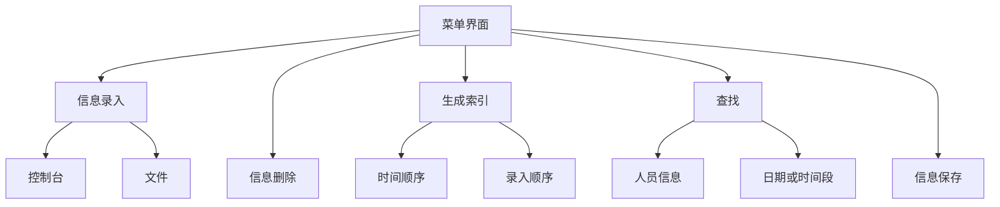
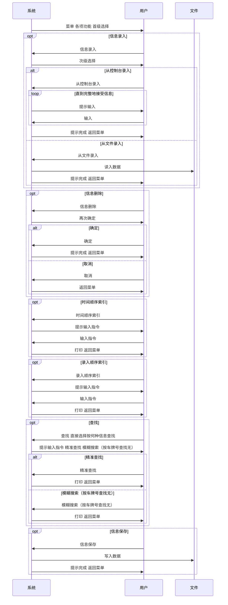

## 程序设计课程实践 项目1 校园外来人员进出监控与管理系统

## a brief intro

[TOC]

### 利用规则

放一些以 utf-8 和 gbk 编码的源代码，还有极少量的数据集，不建议使用。可能有错误。

使用请注明本家和作者，或者github的地址。

不准二次配布。不准商用。有任何疑问欢迎联系，联系方式大概可以从github主页上找到。祝使用愉快。

### 作者

[@hphuimen](https://github.com/hphuimen)  [@octay](https://github.com/octay)  [@yeshuimuhua](https://github.com/yeshuimuhua)

### 功能一览

1. 信息录入
	1.1 从控制台录入
	1.2 从文件录入
2. 信息删除
3. 时间顺序索引
	3.1 选定时间范围
	3.2 focus on 健康码
	3.3 focus on 有无经过疫区
	3.4 focus on 有无症状
	3.5 升序降序
4. 录入顺序索引
	4.1 focus on 健康码
	4.2 focus on 有无经过疫区
	4.3 focus on 有无症状
	4.4 升序降序
5. 按名字查找
	5.1 精准查找
	5.2 模糊搜索
6. 按手机号查找
	6.1 精准查找
	6.2 模糊搜索
7. 按身份证号查找
	7.1 精准查找
	7.2 模糊搜索
8. 按车牌号查找
	8.1 精准查找
9. 按日期查找
10. 按时间段查找
11. 信息保存

### 功能流程图



### 业务流程图



### 信息从文件录入的格式

姓名 身份证号 手机号码 公司 车牌号 担保人姓名 担保人电话号码 健康码颜色 是否经过疫区 是否有症状 申请入校时间 申请出校时间 实际入校时间 实际出校时间 申请理由

实现信息从文件录入的代码片段。

```c
fscanf(fp, "%s %s %s %s %s %s %s %c %d %d", temp_hito.name, temp_hito.id, temp_hito.tel, temp_hito.company, temp_hito.car_num, temp_hito.guarantee_name, temp_hito.guarantee_tel, &temp_hito.health_code, &temp_hito.is_area, &temp_hito.is_symptom);
fscanf(fp, "%d-%d-%d %d:%d:%d", &temp_hito.in_time_app.year, &temp_hito.in_time_app.mon, &temp_hito.in_time_app.day, &temp_hito.in_time_app.hour, &temp_hito.in_time_app.min, &temp_hito.in_time_app.sec);
fscanf(fp, "%d-%d-%d %d:%d:%d", &temp_hito.out_time_app.year, &temp_hito.out_time_app.mon, &temp_hito.out_time_app.day, &temp_hito.out_time_app.hour, &temp_hito.out_time_app.min, &temp_hito.out_time_app.sec);
fscanf(fp, "%d-%d-%d %d:%d:%d", &temp_hito.in_time_act.year, &temp_hito.in_time_act.mon, &temp_hito.in_time_act.day, &temp_hito.in_time_act.hour, &temp_hito.in_time_act.min, &temp_hito.in_time_act.sec);
fscanf(fp, "%d-%d-%d %d:%d:%d", &temp_hito.out_time_act.year, &temp_hito.out_time_act.mon, &temp_hito.out_time_act.day, &temp_hito.out_time_act.hour, &temp_hito.out_time_act.min, &temp_hito.out_time_act.sec);
fgets(temp_hito.particular, 140, fp);
```

### 关于数据

姓名 / 身份证号 / 手机号码 信息是用网络上可以找到的生成器生成的。车牌号 / 公司 / 申请理由 就不占用工时了，这些信息不会影响主体功能。

