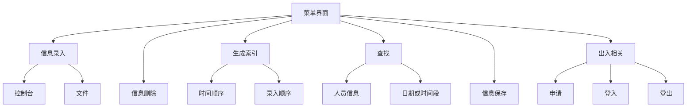
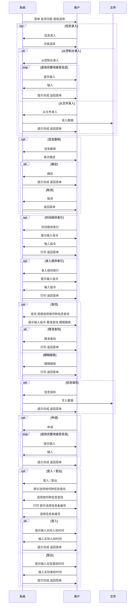

## 程序设计课程实践 综合项目1 校园外来人员进出监控与管理系统

## a brief intro for ver0.2

[TOC]

### 利用规则

放一些以 utf-8 和 gbk 编码的源代码，还有极少量的数据集，不建议使用。可能有错误。

使用请注明本家和作者，或者github的地址。

不准二次配布。不准商用。有任何疑问欢迎联系，联系方式大概可以从github主页上找到。祝使用愉快。

### 作者

[@hphuimen](https://github.com/hphuimen)  [@octay](https://github.com/octay)  [@yeshuimuhua](https://github.com/yeshuimuhua)  

### 程序目的

本组通过调研调查和任务书上的指导建议，大体地规划出校园外来人员进出监控与管理系统的一般功能和各个模块。随后根据各模块具体的实现列出需要的头文件，编写宏定义，同时，针对校园外来人员进出信息管理的需求，将各种信息用合适的变量类型定义结构体，并编写main()函数框架。然后，本组各成员在约定了一些函数命名规范、控制台输入输出、文件写入读入规范之后编写各模块与主函数。

为了方便程序的编写，本组在源文件的开头添加了相关信息。其中，版本号在具体编写各函数与主函数时发挥着不可或缺的作用，每一次提交代码都需更新版本号，例如ver0.0.1 → ver0.0.2。本intro面向ver0.2，可以完成信息录入、信息删除、生成索引、查找、信息保存等主要功能，并且实装了申请、登入、登出等附加的出入相关功能，可供使用。

信息录入功能能够从控制台或文件录入外来人员的人员信息和申请出入校时间、实际出入校时间。使用者请注意，不管是调试或者是试用，从控制台或文件录入手机号与身份证号时，程序会默认对录入的手机号和身份证号进行判误。

```c
printf("输入 身份证号");
scanf("%s", temp_hito.id);
if (strlen(temp_hito.id) != 18) return;     // judge id
for (int i = 0; i < 17; ++i) if (!isdigit(temp_hito.id[i])) return;
if (isdigit(temp_hito.id[17] == 0 || temp_hito.id[17] == 'x' || temp_hito.id[17] == 'X')) return;
temp_hito.sex = (temp_hito.id[16] - '0' % 2 == 0) ? 2 : 1;  // judge sex from id
```

```c
printf("输入 手机号码");
scanf("%s", temp_hito.tel);
for (int i = 0; temp_hito.tel[i] != '\0'; ++i) if (!isdigit(temp_hito.tel[i])) return;  // judge tel
```

信息删除功能可以撤销最后一次输入的信息。索引可以按时间顺序和录入顺序生成。查找功能支持姓名、身份证号、手机号码、车牌号搜索，除车牌号只支持精准查找以外，其他三项同时支持精准查找和模糊查找。信息保存功能能够将信息保存至文本文件中，下一次启用时，只需要从文件录入信息即可。

申请功能，即从控制台录入人员信息和申请出入校时间。登入登出功能，先进行搜索，再提示用户选择相应的信息条编号，从控制台分别录入实际出入校时间。

按车牌号查找在ver0.2中做了边缘化处理，考虑到外来人员不一定都会留下车牌号，按车牌号查找功能的实用性低。在登入登出功能中的查找分块也不包括按车牌号查找。

### 关于数据

姓名 / 身份证号 / 手机号码 信息是用网络上可以找到的生成器生成的。车牌号 / 公司 / 申请理由 就不占用工时了，这些信息不会影响主体功能。

为了方便程序读写，在txt中直笔编辑时请预留换行。

```
陈柯山 320281200008051372 13659634982 公司 车牌号 邵佳融 17856392267 g 0 0 2021-06-12 10:00:00 2021-06-12 17:00:00 2021-06-12 10:20:03 2021-06-12 15:42:64 申请理由
许忆文 450101200110148017 17348293531 公司 车牌号 孙方 13756632039 g 0 0 2021-06-12 11:00:00 2021-06-12 16:00:00 2021-06-12 11:23:13 2021-06-12 16:02:11 申请理由

```

### 功能一览

1. 信息录入
	1.1 从控制台录入
	1.2 从文件录入
2. 信息删除
3. 时间顺序索引
	3.1 选定时间范围
	3.2 focus on 健康码
	3.3 focus on 有无经过疫区
	3.4 focus on 有无症状
	3.5 升序降序
4. 录入顺序索引
	4.1 focus on 健康码
	4.2 focus on 有无经过疫区
	4.3 focus on 有无症状
	4.4 升序降序
5. 按名字查找
	5.1 精准查找
	5.2 模糊搜索
6. 按手机号查找
	6.1 精准查找
	6.2 模糊搜索
7. 按身份证号查找
	7.1 精准查找
	7.2 模糊搜索
8. 按日期查找
9. 按时间段查找
10. 信息保存
11. 申请
12. 登入
13. 登出
0. 退出

### 功能流程图



### 业务流程图



### 信息从文件录入的格式

姓名 身份证号 手机号码 公司 车牌号 担保人姓名 担保人电话号码 健康码颜色 是否经过疫区 是否有症状 申请入校时间 申请出校时间 实际入校时间 实际出校时间 申请理由

实现信息从文件录入的代码片段。

```c
fscanf(fp, "%s %s %s %s %s %s %s %c %d %d", temp_hito.name, temp_hito.id, temp_hito.tel, temp_hito.company, temp_hito.car_num, temp_hito.guarantee_name, temp_hito.guarantee_tel, &temp_hito.health_code, &temp_hito.is_area, &temp_hito.is_symptom);
fscanf(fp, "%d-%d-%d %d:%d:%d", &temp_hito.in_time_app.year, &temp_hito.in_time_app.mon, &temp_hito.in_time_app.day, &temp_hito.in_time_app.hour, &temp_hito.in_time_app.min, &temp_hito.in_time_app.sec);
fscanf(fp, "%d-%d-%d %d:%d:%d", &temp_hito.out_time_app.year, &temp_hito.out_time_app.mon, &temp_hito.out_time_app.day, &temp_hito.out_time_app.hour, &temp_hito.out_time_app.min, &temp_hito.out_time_app.sec);
fscanf(fp, "%d-%d-%d %d:%d:%d", &temp_hito.in_time_act.year, &temp_hito.in_time_act.mon, &temp_hito.in_time_act.day, &temp_hito.in_time_act.hour, &temp_hito.in_time_act.min, &temp_hito.in_time_act.sec);
fscanf(fp, "%d-%d-%d %d:%d:%d", &temp_hito.out_time_act.year, &temp_hito.out_time_act.mon, &temp_hito.out_time_act.day, &temp_hito.out_time_act.hour, &temp_hito.out_time_act.min, &temp_hito.out_time_act.sec);
fgets(temp_hito.particular, 140, fp);
```

